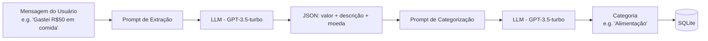
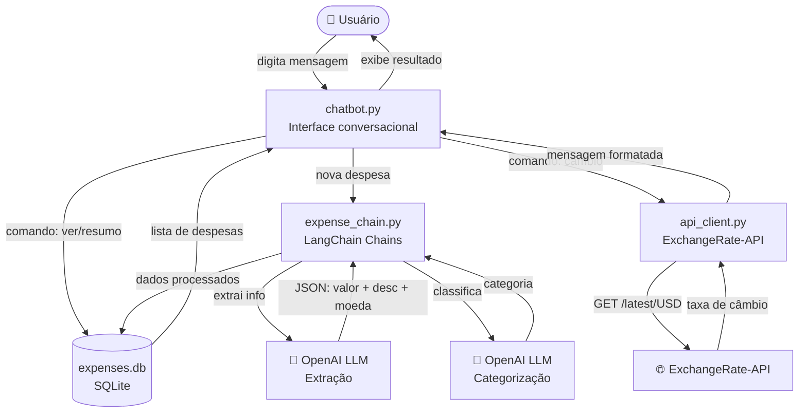
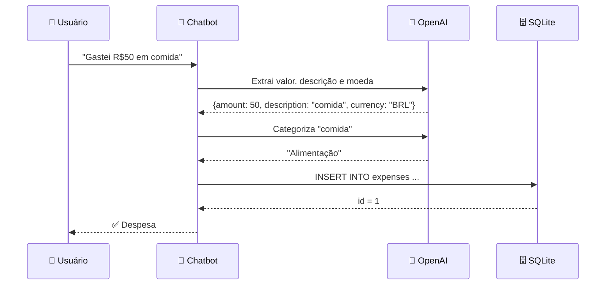

# 💰 Contabiliza-o — Tracker de Despesas com IA

> Seu assistente pessoal de controle financeiro, construído com **Python**, **LangChain** e **OpenAI**.

[](https://www.python.org/)
[](https://python.langchain.com/)
[](https://sqlite.org/)
[](#-testes)

---

## 📖 Sobre o Projeto

O **Contabiliza-o** é um chatbot conversacional que permite registrar, categorizar e visualizar despesas do dia a dia usando linguagem natural. Ele foi construído como projeto de estudo cobrindo:

| Área | Tecnologia |
|---|---|
| 🤖 IA Conversacional | LangChain + OpenAI (GPT-3.5-turbo) |
| ⚙️ Automação de Fluxos | Chain multi-etapas (extração → categorização → armazenamento) |
| 🔌 Integração de APIs | ExchangeRate-API (taxas de câmbio em tempo real) |
| 🗄️ Banco de Dados | SQLite com operações SQL básicas |
| 📑 Documentação | README com diagramas Mermaid e mapeamento de processos |

---

## 🗂️ Estrutura do Projeto

```
contabiliza-o/
├── main.py                  # Ponto de entrada — execute para iniciar o chatbot
├── requirements.txt         # Dependências Python
├── .env.example             # Template de variáveis de ambiente
├── .gitignore
│
├── src/
│   ├── __init__.py
│   ├── chatbot.py           # Interface conversacional (loop principal)
│   ├── expense_chain.py     # Chains LangChain para extração e categorização
│   ├── database.py          # Módulo SQLite (CRUD de despesas)
│   └── api_client.py        # Integração com API de câmbio
│
└── tests/
    ├── __init__.py
    ├── test_database.py     # Testes do módulo de banco de dados
    ├── test_api_client.py   # Testes da integração com API
    └── test_expense_chain.py # Testes das chains LangChain
```

---

## 🚀 Como Executar Localmente

### 1. Pré-requisitos

- Python 3.11+
- Uma chave da API OpenAI ([obtenha aqui](https://platform.openai.com/api-keys))

### 2. Instale as dependências

```bash
pip install -r requirements.txt
```

### 3. Configure as variáveis de ambiente

```bash
cp .env.example .env
```

Edite o arquivo `.env` e preencha:

```env
OPENAI_API_KEY=sk-...          # Obrigatória para categorização com IA
EXCHANGERATE_API_KEY=...        # Opcional — para consultas de câmbio
DEFAULT_CURRENCY=BRL            # Moeda padrão
```

### 4. Inicie o chatbot

```bash
python main.py
```

---

## 💬 Usando o Chatbot

Ao iniciar, você verá o banner de boas-vindas. Basta digitar em linguagem natural:

```
╔══════════════════════════════════════════════════════╗
║         💰  Contabiliza-o — Tracker de Despesas      ║
║     Seu assistente pessoal de finanças com IA 🤖     ║
╚══════════════════════════════════════════════════════╝

Você: Gastei R$50 em comida
🤔 Analisando sua despesa...

✅ Despesa registrada com sucesso!
   ID          : #1
   Descrição   : comida
   Valor       : BRL 50.00
   Categoria   : Alimentação

Você: Paguei 30 de uber
Você: ver
Você: resumo
Você: câmbio USD BRL
Você: sair
```

### Comandos disponíveis

| Comando | Descrição | Exemplo |
|---|---|---|
| `<mensagem livre>` | Registra uma despesa | `"Gastei R$30 no almoço"` |
| `ver` | Lista todas as despesas | `ver` |
| `resumo` | Total gasto por categoria | `resumo` |
| `câmbio <DE> <PARA>` | Taxa de câmbio atual | `câmbio USD BRL` |
| `ajuda` | Exibe os comandos | `ajuda` |
| `sair` | Encerra o programa | `sair` |

---

## 🧠 Como Funciona a IA

O chatbot usa **LangChain** para processar mensagens em duas etapas (chain):

### Chain de Processamento



**Passo 1 — Extração (`extract_expense_info`):**
- Recebe a mensagem do usuário
- O LLM interpreta e retorna um JSON com `amount`, `description` e `currency`

**Passo 2 — Categorização (`categorize_expense`):**
- Recebe a descrição extraída
- O LLM classifica em uma das 10 categorias pré-definidas

**Categorias suportadas:**
`Alimentação` · `Transporte` · `Moradia` · `Saúde` · `Lazer` · `Educação` · `Roupas` · `Tecnologia` · `Serviços` · `Outros`

---

## 🏗️ Arquitetura e Fluxo de Dados



---

## 🗄️ Banco de Dados

O banco **SQLite** (`expenses.db`) é criado automaticamente na primeira execução.

### Schema da tabela `expenses`

```sql
CREATE TABLE expenses (
    id          INTEGER PRIMARY KEY AUTOINCREMENT,
    description TEXT    NOT NULL,          -- Descrição da despesa
    amount      REAL    NOT NULL,          -- Valor gasto
    category    TEXT    NOT NULL DEFAULT 'Outros',  -- Categoria (classificada por IA)
    currency    TEXT    NOT NULL DEFAULT 'BRL',     -- Código ISO da moeda
    date        TEXT    NOT NULL,          -- Data (YYYY-MM-DD)
    created_at  TEXT    NOT NULL           -- Timestamp de criação
);
```

### Operações disponíveis

```python
from src.database import (
    initialize_database,    # Cria a tabela (se não existir)
    add_expense,            # INSERT de nova despesa
    get_all_expenses,       # SELECT * ORDER BY date DESC
    get_expenses_by_category,  # SELECT WHERE category = ?
    get_summary_by_category,   # GROUP BY category com SUM(amount)
    get_total_spent,           # SUM(amount) total
)
```

---

## 🔌 Integração com API de Câmbio

O módulo `api_client.py` consome a [ExchangeRate-API](https://www.exchangerate-api.com/):

```python
from src.api_client import get_exchange_rate, convert_amount

# Busca taxa de câmbio
rate = get_exchange_rate("USD", "BRL")  # ex.: 5.12

# Converte valor
valor_brl = convert_amount(100, "USD", "BRL")  # ex.: 512.0
```

> **Nota:** Funciona sem chave de API usando o endpoint gratuito `open.er-api.com`. Para maior limite de requisições, configure `EXCHANGERATE_API_KEY` no `.env`.

---

## 🔄 Mapeamento de Processos

### Tarefa repetitiva automatizada: Registrar despesas manualmente

**Antes (sem o chatbot):**
1. Abrir planilha ou aplicativo
2. Selecionar categoria manualmente
3. Digitar valor, data e descrição
4. Salvar

**Com o Contabiliza-o:**
1. Digitar `"Gastei R$50 em comida"` → tudo é feito automaticamente



---

## 🧪 Testes

Execute os testes unitários com:

```bash
python -m pytest tests/ -v
```

Os testes cobrem:
- **`test_database.py`** — Operações CRUD no SQLite (15 testes)
- **`test_api_client.py`** — Integração com API de câmbio com mocks (11 testes)
- **`test_expense_chain.py`** — Chains LangChain com RunnableLambda mocks (10 testes)

> Total: **36 testes**, todos passando ✅

---

## 📚 Conceitos Estudados

| Conceito | Onde aplicado |
|---|---|
| **Prompts LLM** | `expense_chain.py` — `ChatPromptTemplate` com system/human messages |
| **LangChain Chains** | Pipeline `prompt \| llm \| parser` em dois passos |
| **REST API** | `api_client.py` — `requests.get()` para ExchangeRate-API |
| **SQL básico** | `database.py` — `INSERT`, `SELECT`, `GROUP BY`, `SUM` |
| **SQLite** | Banco local sem servidor, arquivo `expenses.db` |
| **Variáveis de ambiente** | `.env` + `python-dotenv` para chaves de API |
| **Mocks em testes** | `unittest.mock.patch` + `RunnableLambda` para testes offline |
| **Diagramas de fluxo** | Mermaid no README |

---

## 🤝 Contribuindo

1. Fork o repositório
2. Crie uma branch: `git checkout -b feature/nova-funcionalidade`
3. Commit: `git commit -m "feat: adiciona nova funcionalidade"`
4. Push: `git push origin feature/nova-funcionalidade`
5. Abra um Pull Request

---

## 📄 Licença

MIT — veja [LICENSE](LICENSE) para detalhes.
